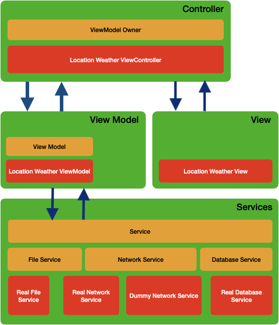

# Live Weather App

**Live Weather App** shows live weather data fetched from [Metaweather](https://www.metaweather.com).

It consists of single screen, showing preconfigured number of cities whose weather data is fetched from API.

Locations can be preconfigured from [Locations.json](https://github.com/vividcode/LiveWeather/blob/main/Locations.json).

For iPad, the app shows up to 8 locations. For iPhone, 4 locations are shown.

Empty/Invalid `Locations.json` produces error alert.

Weather API data is fetched every 1 minute (for Prod app) and 10 seconds (for Dev configuration).

## Screen Layout:

&nbsp&nbsp&nbsp

# App Architecture Overview:

Core protocols (shown in yellow color above) that drive the app:

## Services

- **Service**: This is a top level protocol of all services. Instances of this are injected into **ViewModel**.
- **NetworkService**: Protocol handling network service. Concrete implementations are **RealNetworkService** (fetching data from metaweather) and **DummyNetworkService** (used for testing).
- **FileService**: Protocol handling file operations. Concrete implementation is **RealFileService.**
- **DatabaseService**: Protocol handling database operations. Concrete implementation is **RealDatabaseService.** Not used in current app - just a placeholder.

## Models

All 3 model structs (**Location**, **Weather** and **LocationWeather**) implement [Codable](https://developer.apple.com/documentation/swift/codable) - so it is possible to create them from JSON response / file.

## ViewModel

**ViewModel** is the protocol that represents all viewmodels in the app. Every ViewModel implementor class must have:

- **updateUICallback**: Block that must be invoked every time new data is available for display
- **errorCallback**: Block that must be invoked to notify user about the error
- **services**: Array that is filled with **Service** protocol implementors.

Apart from these, every ViewModel has optional getters to access **NetworkService**, **FileService** and **DatabaseService** injected into it inside **services** array.

In the current app, `LocationWeatherViewModel.swift` maintains a timer to regularly invoke network calls, fetch data, and update viewcontroller about data/error via callbacks.

The callbacks are just indications. They do not pass any data to viewcontrollers. This is to avoid copying of structs. Viewcontroller has direct access to its own viewmodel data structures, and it uses them every time it receives callbacks.

## ViewModelOwner

This protocol is implemented by View Controllers. Its main responsibility is to initialize associated **ViewModel** as part of **viewDidLoad** or equivalent.

Every view controller initializes its own optional viewmodel inside `initializeViewModel()` and then onwards starts getting callbacks from viewmodel regarding data/error update.

The sole purpose of `initializeViewModel()` is to **inject services and callbacks** into underlying viewmodel.

`LocationWeatherViewController.swift` has single optional `viewModel` property.
However, a view controller can hold one / more / zero viewmodels, depending upon the requirement. No constraint exists for viewmodel var(s) within **ViewModelOwner**.
Likewise, single viewmodel can be shared by multiple view controllers, to enable different representations of same data.

Since timed operation is an implementation detail, `LocationWeatherViewController` must ask its viewmodel to start the timer using `viewModel.startTimer()` call and stop it using `viewModel.stopTimer()`. Timer does not start automatically as part of `initializeViewModel()`.

## Service Implementations:

### Networking:

`RealNetworkService.swift` holds all functions to handle network activity. It maintains a strong reference to `URLSession` object.
`RequestFactory.swift` creates GET requests, and also caches them based on entity URLs.

### File Operations:

`RealFileService.swift` has capability to convert JSON (from Stubs) into all 3 models (**Location**, **Weather** and **LocationWeather**) and their arrays.

### Extensions:

Extensions to in-built iOS classes are contained in [Extensions folder](https://github.com/vividcode/LiveWeather/tree/main/LiveWeather/Extensions).

## UI:

The only view for the app is contained within [LocationWeatherView.swift](https://github.com/vividcode/LiveWeather/blob/main/LiveWeather/LocationWeather/LocationWeatherView.swift), and is handled by [LocationWeatherViewController.swift](https://github.com/vividcode/LiveWeather/blob/main/LiveWeather/LocationWeather/LocationWeatherViewController.swift).

The view is drawn using [SnapKit](https://github.com/SnapKit/SnapKit) auto layout constraints. The whole operation is handled within `updateViewConstraints()` viewcontroller override.

View changes can be batched using [UIView extension](https://github.com/vividcode/LiveWeather/blob/main/LiveWeather/Extensions/View.swift) `applySubViewChanges()` method which adopts **functional programming + Generics** approach to make bulk changes to all subviews of specific class.

# Unit Tests:

`LiveWeatherTests` target contains tests about JSON => Model conversion, and tests for `LocationWeatherViewModel.swift`.
They use `DummyNetworkService` to mock network api data.

# Limitations/Caveats:

- Debug version updates weather every 10 seconds, just to minimize wait. Prod version uses 1 minute.
  This, and many more configurations, can be configured using [Constants.swift](https://github.com/vividcode/LiveWeather/blob/main/LiveWeather/Utilities/Constants.swift).

- The app is capable of knowing when it is/goes offline, and reports this via a status label.
  In case of coming back **online from offline**, iOS simulator fail to detect the same, and keeps showing error status until app is restarted.
  This problem is not observed in the device testing on iOS 14.0 (i.e. **online<=>offline** transition is correctly detected by the app.)
